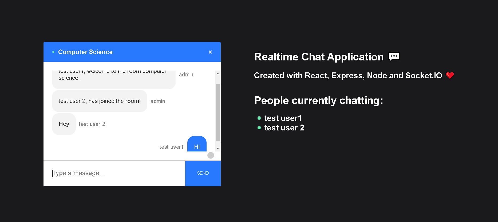

#Introduction

The Chat-App web-application project is developed using ReactJs, ExpressJs, NodeJs and Socket.io. It is a realtime chat application project which users to create a room and join into particular and begin with the chatting.
This Realtime and Instant messaging in the project is achieved through the Socket.io (A Realtime application framework). Socket.io is not only used for realtime transmission of messages but also any other data formats like files and etc. But here in the chat-application we are using it for transferring our messages.

Also with the help of some other module of the NodeJs the application consist of some more features to make it more interactive. Some modules used are :-

> Emojify - to convert users text/symbols to emoji during chat. e.g.:- <3 = ❤ , :D = 😃.
> Scroll-To-Bottom - It provides scrollbar on a side of chat container when there has been too many messages in the room and also an button to instantly reach to the bottom of the chat.

###Join Page

###Chat Page

#To run the project follow below steps:-

For the chat-application to run we must first make our server running. To do so open the project in suitable editor. Then open the terminal and change directory of that terminal to the server directory. and execute the command :- "nodemon index.js" then our server will be up and running on port 5000. You can test it by opening your browser and going to "localhost:5000" URL.

Once the server is up and running we must run our client and for that open new terminal and change the directory of the new terminal to client directory and execute "npm start" then our client will be running on the default port of the React i.e.3000. So when we goto "localhost:3000" there our chat-application will be visible and we can start to use it.

This react application has only two major components :-
Join - Through which user joins into specific room by entering respective username and room-name or Creates a new room.
Chat - In this component the messaging container is present where we can enter our message and all the messages of the room will be displayed. This component also provide feature to display users present in the room and appropriate messages when someone joins or leaves the room.

Credits :- adrianhajdin (Youtuber) for given such simple-way and explanation to create extraordinary [chat-application](https://www.youtube.com/watch?v=ZwFA3YMfkoc).
